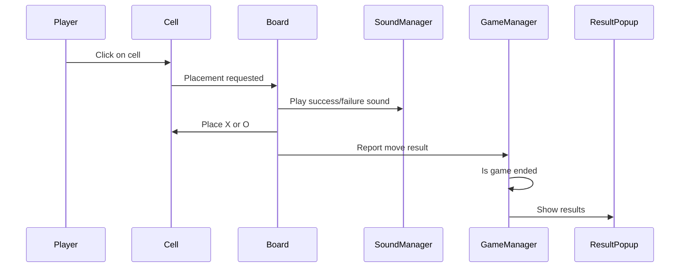
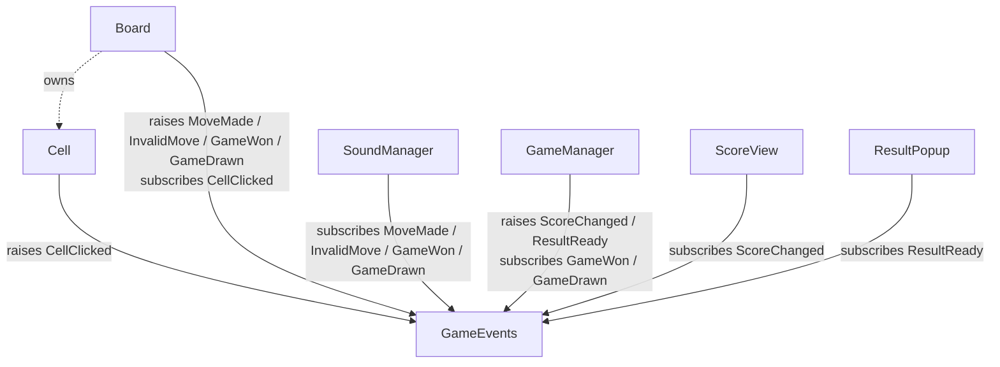

# Desciption
A local multiplayer Tic-Tac-Toe game built with simple 3D objects for the board, X, and O.
Players take turns clicking cells to place their mark. The game handles turn switching, valid and invalid moves, win/draw detection, session score tracking, and a result popup at the end of each round.
Player actions and game results are supported by sounds for valid and invalid moves

# Requirements
- Playable local TIC-TAC-TOE GAME
- Visual interface
- Working Results popup
- Working sounds

# Elements
- Cell
- Board
- SoundManager
- GameManager
- Score View
- Result Popup
- New Game Button

# Dependencies

All communication goes through `GameEvents`, a single static event aggregator. No business class references another — they only know about `GameEvents`. The only remaining structural reference is `Board` owning its `Cell[]` for state queries.

